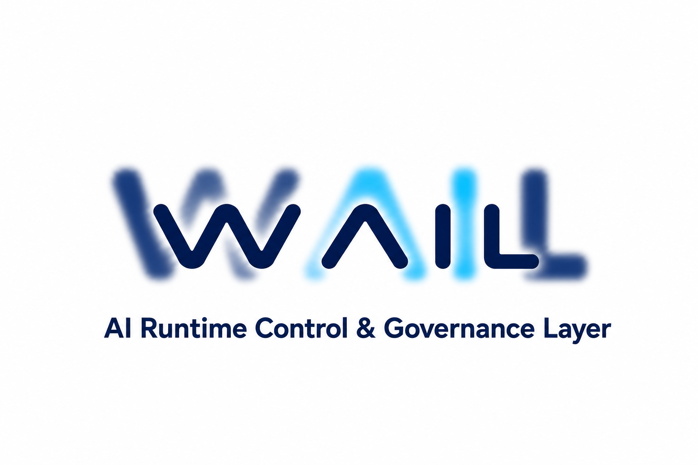
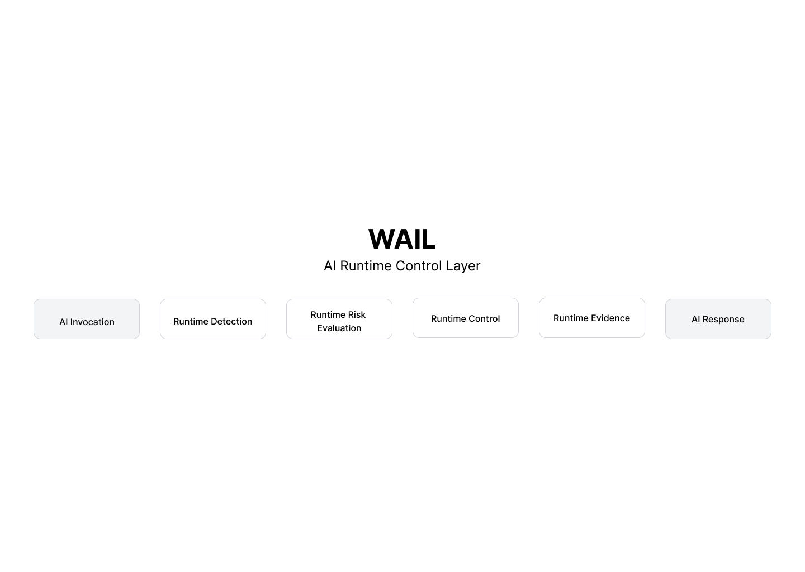

<p align="center">
  
</p>

<p align="center">
  <strong>Runtime detection · Runtime control · Governance · Signed execution evidence</strong>
</p>

<p align="center">
  <a href="docs/getting-started.md">Getting Started</a> ·
  <a href="docs/architecture.md">Architecture</a> ·
  <a href="docs/runtime-control.md">Runtime Control</a> ·
  <a href="docs/evidence-model.md">Evidence Model</a> ·
  <a href="docs/why-wail.md">Why WAIL</a> ·
  <a href="docs/telemetry.md">Telemetry</a>
</p>

AI requests don't always behave as expected.

They slow down, time out, fail, or become unreliable.

Most applications can detect these runtime issues. Few can control what happens next.

WAIL is an AI Runtime Control and Governance Layer for production AI systems. It observes execution as it happens, detects unhealthy runtime behavior, and can retry or reroute execution when intervention is justified. Every decision and action can be recorded as signed, verifiable evidence.

WAIL is not a gateway. It works with your existing provider SDK and request flow instead of replacing them.

Runtime reroute applies to the next request and does not permanently change the model or provider configured by your application.

---

## Architecture



---

## What WAIL Does

- **Detect Runtime Issues** — Observe AI execution and identify abnormal latency, streaming behavior, errors, timeouts, and other runtime degradation.
- **Assess Execution Health** — Determine how serious a runtime issue is and whether it justifies intervention.
- **Evaluate Alternatives** — Compare observed models and providers using live runtime measurements when another execution path may be needed.
- **Control Runtime Execution** — Retry or reroute when runtime conditions and policy justify intervention; otherwise preserve the application's current execution path.
- **Record What Happened** — Produce signed, verifiable runtime evidence for decisions, actions, and execution outcomes.
- **Support Governance** — Preserve structured incident and execution records for governance, audit, and compliance workflows where enabled.

### Runtime Control Loop

```text
Runtime measurements
        ↓
Baseline + anomaly detection
        ↓
Risk / severity evaluation
        ↓
Candidate scoring
        ↓
Runtime decision
        ↓
Intervention when required
(next request for runtime reroute)
        ↓
Signed execution evidence
```

WAIL does not route requests simply because another model scores better. Candidate ranking informs runtime control; intervention remains driven by observed runtime conditions and control policy.

---

## Installation

Install WAIL from PyPI:

```bash
pip install wail-runtime
```

---

## Quick Start

Wrap your existing AI client with WAIL.

```python
from openai import OpenAI
import wail

client = wail.wrap(OpenAI())
```

Use it exactly as you normally would.

```python
response = client.responses.create(
    model="gpt-4o-mini",
    input="Explain what WAIL does."
)

print(response.output_text)
```

After each request, WAIL prints a runtime summary.

```text
┌────────────── WAIL AI Runtime Control Layer ─────────────┐
│                                                          │
│  Plan               Developer                            │
│  Provider           openai                               │
│  Model              gpt-4o-mini                          │
│                                                          │
│  Duration           2,220 ms                             │
│  TTFT               1,981 ms                             │
│  Throughput         3.97 tok/s                           │
│  Mean Token Gap     4 ms                                 │
│                                                          │
│  Active Signals     0                                    │
│  Runtime Severity   NONE                                 │
│  Risk Score         0.00                                 │
│  Dominant Surface   NONE                                 │
│                                                          │
│  Decision           OBSERVE                              │
│  Trace              SAVED · 01M1BQ593...                 │
│                                                          │
└──────────────────────────────────────────────────────────┘
```

Every execution also generates a signed runtime artifact that includes:

- Runtime observations
- Execution assessment
- Runtime decisions
- Control actions
- Execution outcome
- Cryptographic integrity metadata

---

## Supported Providers

| Provider | Runtime Detection | Runtime Control | Runtime Evidence |
|----------|:-----------------:|:---------------:|:----------------:|
| OpenAI | ✅ | ✅ | ✅ |
| Anthropic | ✅ | ✅ | ✅ |
| Google Gemini | ✅ | ✅ | ✅ |
| OpenRouter | ✅ | ✅ | ✅ |
| Ollama | ✅ | ✅ | ✅ |
| OpenAI-compatible Local LLMs | ✅ | ✅ | ✅ |

The runtime evidence model remains consistent across all supported providers.

---

## CLI

Inspect and verify runtime artifacts directly from the command line.

```bash
wail traces incidents

wail trace show <TRACE_ID>

wail verify <ARTIFACT_FILE>
```

---

## Documentation

Learn more about WAIL:

- [Getting Started](docs/getting-started.md)
- [Why WAIL](docs/why-wail.md)
- [Architecture](docs/architecture.md)
- [Runtime Control](docs/runtime-control.md)
- [Runtime Evidence Model](docs/evidence-model.md)
- [Provider Integration](docs/provider-integration.md)
- [Runtime Artifact Reference](docs/artifact-reference.md)
- [CLI Reference](docs/CLI.md)
- [Telemetry](docs/telemetry.md)