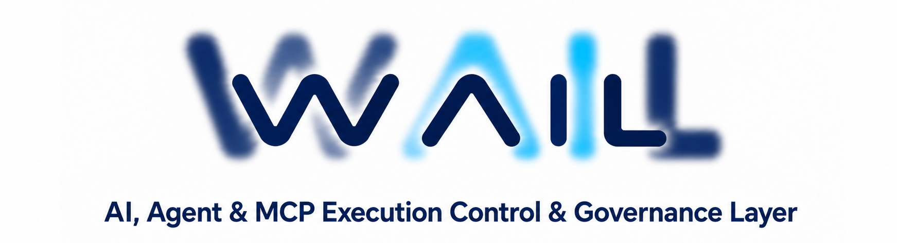

<p align="center">
  
</p>

<p align="center">
  <strong>Runtime detection · Runtime control · Agent & MCP execution · Governance · Signed execution evidence</strong>
</p>

<p align="center">
  <a href="docs/getting-started.md">Getting Started</a> ·
  <a href="docs/architecture.md">Architecture</a> ·
  <a href="docs/runtime-control.md">Runtime Control</a> ·
  <a href="docs/evidence-model.md">Evidence Model</a> ·
  <a href="docs/why-wail.md">Why WAIL</a> ·
  <a href="docs/telemetry.md">Telemetry</a>
</p>

AI requests don't always behave as expected.

They slow down, time out, fail, or become unreliable. Agent systems add another execution surface: models call tools, agents delegate work, MCP operations fail, and recovery can span more than one execution.

Most applications can detect some of these runtime issues. Few can control what happens next while preserving verifiable evidence of what was observed, decided, executed, and recovered.

WAIL is an **AI Runtime Control and Governance Layer** for production AI systems. It observes execution as it happens, detects unhealthy runtime behavior, and can retry or reroute execution when intervention is justified.

WAIL also extends execution tracking, runtime control, recovery, and signed evidence across **agent and MCP workloads**.

WAIL is **not a gateway, agent framework, or workflow engine**. It works with your existing provider SDK, request flow, agent orchestration, and MCP sessions instead of replacing them.

Standard provider runtime reroute applies to the next request and does not permanently change the model or provider configured by your application.

---

## Architecture


WAIL operates around the execution path rather than replacing it.

For direct model execution, WAIL observes and controls provider requests.

For agent and MCP execution, WAIL can represent the active workload as an **Agent Run** containing connected agent, model, and MCP tool execution units.

Delegation, call, and join relationships preserve how execution moved through the run.

---

## What WAIL Does

- **Detect Runtime Issues** — Observe AI execution and identify abnormal latency, streaming behavior, errors, timeouts, tool failures, and other runtime degradation.
- **Assess Execution Health** — Determine how serious a runtime issue is and whether it justifies intervention.
- **Evaluate Alternatives** — Compare observed models, providers, or configured recovery paths when another execution path may be needed.
- **Control Runtime Execution** — Retry or reroute when runtime conditions and policy justify intervention; otherwise preserve the application's current execution path.
- **Track Agent Execution** — Represent agent, model, and MCP tool activity as connected execution units within an Agent Run.
- **Track Execution Relationships** — Preserve delegation, call, and join relationships across multi-agent execution.
- **Apply MCP Runtime Recovery** — Observe MCP tool execution and apply configured retry or reroute behavior when runtime control requires it.
- **Verify Recovery** — Preserve the relationship between the execution that produced a recovery decision and the execution where recovery was applied, including the resulting recovery state.
- **Record What Happened** — Produce signed, verifiable runtime and Agent Run evidence for observations, decisions, actions, execution relationships, and outcomes.
- **Support Governance** — Preserve structured incident and execution records for governance, audit, and compliance workflows where enabled.

### Runtime Control Loop

```text
Runtime measurements
        ↓
Baseline + anomaly detection
        ↓
Risk / severity evaluation
        ↓
Candidate scoring
        ↓
Runtime decision
        ↓
Intervention when required
        ↓
Recovery application / verification
        ↓
Signed execution evidence
```

WAIL does not route requests simply because another model, provider, or execution target scores better.

Candidate evaluation informs runtime control; intervention remains driven by observed runtime conditions and control policy.

---

## Agent & MCP Execution

WAIL extends its execution model across existing agent orchestration and MCP sessions without becoming the orchestrator itself.

A WAIL Agent Run can preserve:

- agent execution units
- model execution units
- MCP tool execution units
- delegation relationships
- model/tool call relationships
- fan-in and join relationships
- underlying execution trace IDs
- run status
- run-level runtime intelligence where applicable
- runtime recovery and recovery-verification evidence where applicable
- cryptographic integrity metadata

A simplified execution graph can look like this:

```text
Coordinator Agent
        │
        ├── delegates ──> Research Agent
        │                       │
        │                       ├── calls ──> Model
        │                       │
        │                       └── calls ──> MCP Tool
        │
        ├── delegates ──> Verification Agent
        │                       │
        │                       ├── calls ──> Model
        │                       │
        │                       └── calls ──> MCP Tool
        │
        └──────────── joins ────────────┐
                                        ▼
                                  Synthesis Agent
```

The application remains responsible for orchestration and business logic.

WAIL records and evaluates the runtime execution around it.

### Agent & MCP Runtime Output

WAIL preserves runtime visibility at both the **individual execution level** and the **Agent Run level**.

An MCP tool execution is observed as its own runtime execution:

```text
┌────────────── WAIL AI Runtime Control Layer · 20:37:41 ──────────────┐
│  Plan              Pro                                               │
│  Execution Type    MCP Tool                                          │
│  Agent             runtime_worker_agent                              │
│  Tool              wail_probe                                        │
│                                                                      │
│  Duration          106 ms                                            │
│  TTFT              --                                                │
│  Throughput        --                                                │
│  Mean Token Gap    --                                                │
│                                                                      │
│  Active Signals    0                                                 │
│  Runtime Severity  NONE                                              │
│  Risk Score        0.00                                              │
│  Dominant Surface  NONE                                              │
│                                                                      │
│  Decision          OBSERVE                                           │
│  Trace             SAVED · 01M46J933NM3FABPA41ZW9EN2K                │
└──────────────────────────────────────────────────────────────────────┘
```

The complete multi-agent execution is also represented as an Agent Run:

```text
┌────────────── WAIL AI Runtime Control Layer · 20:37:42 ──────────────┐
│  Plan             Developer                                          │
│  Execution Type   Agent Run                                          │
│  Run              run_222738885867458088b6fbc06a686e5b               │
│                                                                      │
│  Agent Units      2                                                  │
│  Model Units      1                                                  │
│  MCP Tool Units   1                                                  │
│  Relations        3                                                  │
│                                                                      │
│  Status           COMPLETED                                          │
│  Signed Evidence  SAVED                                              │
└──────────────────────────────────────────────────────────────────────┘
```

This gives WAIL two connected levels of evidence:

```text
Individual Execution
    │
    ├── Model Trace
    └── MCP Tool Trace
            │
            ▼
        Agent Run
            │
            ├── Agent Units
            ├── Model Units
            ├── MCP Tool Units
            ├── Relations
            └── Signed Evidence
```

Individual model and MCP tool executions remain independently traceable, while the Agent Run preserves how those executions were connected as a single execution graph.

---

## MCP Integration

WAIL wraps an existing MCP client session rather than replacing the MCP transport or server.

```python
from wail.mcp.adapter import wrap_mcp

mcp_client = wrap_mcp(
    session,
    transport="stdio",
    service="mcp",
    env="production",
)
```

Here, `session` is an already initialized MCP `ClientSession`.

Tool calls continue through the wrapped MCP client:

```python
result = await mcp_client.call_tool(
    "inspect_repository",
    arguments={"path": "."},
)
```

When the call occurs inside an active WAIL execution context, WAIL can preserve the MCP operation as a tool execution unit and associate its trace with the active Agent Run.

### MCP Recovery Routes

A backup MCP tool can be configured as an alternate runtime path:

```python
mcp_client = wrap_mcp(
    session,
    transport="stdio",
    routes={
        "primary_tool": "backup_tool",
    },
    service="mcp",
    env="production",
)
```

When runtime conditions naturally produce a supported recovery decision, WAIL can apply the recovery on the subsequent execution and preserve evidence linking the source execution to the applied recovery.

---

## Agent Run

WAIL creates an execution boundary around existing agent orchestration:

```python
import wail

with wail.execution_run(
    attributes={
        "orchestration": "coordinator_worker",
    }
) as run:
    run_id = run.run_id
```

Agent Runs do not replace the application's orchestration model.

They provide an execution boundary for connecting agent, model, and MCP tool activity into a common runtime graph and evidence record.

Within a run, WAIL can preserve relationships including:

```text
Coordinator
    │
    └── delegates ──> Worker
                          │
                          ├── calls ──> Model
                          │
                          └── calls ──> MCP Tool
```

More complex executions can also preserve fan-out and fan-in relationships:

```text
Coordinator
    │
    ├── delegates ──> Agent A ──┐
    ├── delegates ──> Agent B ──┼── joins ──> Synthesis Agent
    └── delegates ──> Agent C ──┘
```

Model and MCP tool executions associated with these agent units retain their individual runtime traces while also becoming part of the Agent Run graph.

For complete working examples, see:

- `examples/multi_agent_mcp_evidence.py`
- `examples/multi_agent_runtime_recovery_evidence.py`

---

## Runtime Recovery

WAIL distinguishes between a **recovery decision**, its later **application**, and verification of the resulting execution.

For supported runtime recovery paths:

```text
Execution N
    │
    ▼
Runtime degradation / failure
    │
    ▼
WAIL runtime decision
RETRY or REROUTE
    │
    ▼
Execution N+1
    │
    ▼
Recovery application
    │
    ▼
Recovery verification
    │
    ▼
Signed evidence
```

A recovery decision is therefore not treated as proof that recovery actually happened.

WAIL can preserve:

- the source run
- the source execution trace
- the selected recovery action
- the execution where recovery was applied
- the applied execution trace
- whether the recovery action was actually executed
- the resulting recovery state

This allows the evidence chain to distinguish:

```text
Decision produced
        ≠
Recovery applied
        ≠
Recovery verified
```

---

## Signed Agent Evidence

Completed Agent Runs can produce signed Agent Run evidence that preserves the connected execution rather than reducing the run to unrelated request logs.

Depending on execution state and available capabilities, Agent Run evidence can include:

- run identity and status
- agent execution units
- model execution units
- MCP tool execution units
- execution relationships
- underlying model and tool trace IDs
- run-level execution intelligence
- runtime recovery state
- recovery application and verification state
- evidence hash
- public-key fingerprint
- RSA-PSS-SHA256 signature

This evidence complements WAIL's per-execution runtime artifacts.

Individual model and tool executions remain traceable while the Agent Run preserves how those executions were related.

---

## Installation

Install WAIL from PyPI:

```bash
pip install wail-runtime
```

WAIL currently requires **Python 3.12**.

---

## Quick Start

Wrap your existing AI client with WAIL.

```python
from openai import OpenAI
import wail

client = wail.wrap(OpenAI())
```

Use it exactly as you normally would.

```python
response = client.responses.create(
    model="gpt-4o-mini",
    input="Explain what WAIL does."
)

print(response.output_text)
```

After each request, WAIL prints a runtime summary.

```text
┌────────────── WAIL AI Runtime Control Layer ─────────────┐
│                                                          │
│  Plan               Developer                            │
│  Provider           openai                               │
│  Model              gpt-4o-mini                          │
│                                                          │
│  Duration           2,220 ms                             │
│  TTFT               1,981 ms                             │
│  Throughput         3.97 tok/s                           │
│  Mean Token Gap     4 ms                                 │
│                                                          │
│  Active Signals     0                                    │
│  Runtime Severity   NONE                                 │
│  Risk Score         0.00                                 │
│  Dominant Surface   NONE                                 │
│                                                          │
│  Decision           OBSERVE                              │
│  Trace              SAVED · 01M1BQ593...                 │
│                                                          │
└──────────────────────────────────────────────────────────┘
```

Every measured execution can also generate signed runtime evidence that includes:

- runtime observations
- execution assessment
- runtime decisions
- control actions
- execution outcome
- cryptographic integrity metadata

---

## Supported Providers

| Provider | Runtime Detection | Runtime Control | Runtime Evidence |
|----------|:-----------------:|:---------------:|:----------------:|
| OpenAI | ✅ | ✅ | ✅ |
| Anthropic | ✅ | ✅ | ✅ |
| Google Gemini | ✅ | ✅ | ✅ |
| OpenRouter | ✅ | ✅ | ✅ |
| Ollama | ✅ | ✅ | ✅ |
| OpenAI-compatible Local LLMs | ✅ | ✅ | ✅ |

The runtime evidence model remains consistent across all supported providers.

Agent and MCP execution support operates around these runtime integrations; MCP itself is an execution interface rather than an AI model provider.

---

## CLI

Inspect and verify runtime artifacts directly from the command line.

```bash
wail traces incidents

wail trace show <TRACE_ID>

wail verify <ARTIFACT_FILE>
```

---

## Documentation

Learn more about WAIL:

- [Getting Started](docs/getting-started.md)
- [Why WAIL](docs/why-wail.md)
- [Architecture](docs/architecture.md)
- [Runtime Control](docs/runtime-control.md)
- [Runtime Evidence Model](docs/evidence-model.md)
- [Provider Integration](docs/provider-integration.md)
- [Runtime Artifact Reference](docs/artifact-reference.md)
- [CLI Reference](docs/CLI.md)
- [Telemetry](docs/telemetry.md)