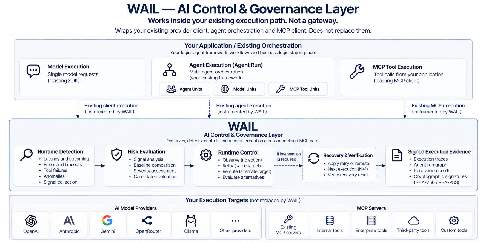

# WAIL Architecture

WAIL is an **AI Control & Governance Layer** that operates inside an application's existing execution path.

It does not replace the application's provider SDK, agent orchestration, MCP infrastructure, or execution targets.

WAIL adds runtime observation, execution control, execution relationships, recovery state, and verifiable evidence around those existing execution paths.



---

# Architectural Position

WAIL operates between application execution semantics and runtime control semantics.

The application continues to own:

- business logic
- provider clients
- agent orchestration
- MCP clients and servers
- model and tool selection
- application-level workflow

WAIL owns the runtime control layer around those executions:

```text
Existing Application Execution
            │
            ▼
    Runtime Observation
            │
            ▼
     Risk Evaluation
            │
            ▼
     Runtime Control
            │
            ├── Observe
            └── Intervention
                    │
                    ▼
             Recovery State
            │
            ▼
      Execution Evidence
```

This separation allows WAIL to control and record runtime behavior without becoming the application's gateway or orchestration framework.

---

# Execution Surfaces

WAIL uses a common execution model across three related surfaces.

```text
Application / Existing Orchestration
            │
     ┌──────┼──────────┐
     │      │          │
     ▼      ▼          ▼
  Model   Agent Run   MCP Tool
Execution             Execution
            │
       ┌────┼────┐
       │    │    │
     Agent Model MCP Tool
     Units Units Units
```

## Model Execution

A model execution represents an individual AI provider execution observed by WAIL.

It retains its own runtime identity and trace-level evidence.

## Agent Run

An Agent Run is the execution boundary for a connected agent workflow.

It can contain Agent Units, Model Units, MCP Tool Units, and the relationships between them.

The Agent Run does not perform orchestration. It represents the execution structure produced by the application's existing orchestration.

## MCP Tool Execution

An MCP tool execution represents an observed tool operation through the application's existing MCP infrastructure.

It can exist as an individual execution and can also participate in an Agent Run.

---

# Execution Identity

WAIL separates execution identity by level.

```text
Agent Run
   │
   ├── Agent Unit
   │      │
   │      ├── Model Unit ───── Trace ID
   │      │
   │      └── MCP Tool Unit ── Trace ID
   │
   └── Agent Unit
          │
          └── ...
```

A **Trace ID** identifies an individual observed execution.

A **Run ID** identifies the larger Agent Run containing related execution units.

This allows individual executions to remain independently traceable while also preserving their position within a larger execution.

---

# Execution Graph

Agent Runs are represented as execution graphs.

Units represent execution participants or operations. Relations describe how execution moved between them.

For example:

```text
Coordinator
    │
    ├── delegates ──> Agent A
    │                     │
    │                     ├── calls ──> Model
    │                     └── calls ──> MCP Tool
    │
    ├── delegates ──> Agent B
    │                     │
    │                     └── calls ──> Model
    │
    └──────────── joins ────────────┐
                                    ▼
                              Synthesis Agent
```

The execution graph can preserve relationships such as:

- `calls`
- `delegates`
- `joins`

These relationships connect otherwise independent runtime executions into a single execution structure.

The graph records execution relationships; it does not define how the application must orchestrate them.

---

# Runtime Architecture

Runtime evaluation remains execution-local.

Each observed model or MCP execution can independently produce runtime state:

```text
Observed Execution
        │
        ▼
Runtime Signals
        │
        ▼
Runtime Evaluation
        │
        ▼
Runtime Decision
        │
        ▼
Control State
```

Agent Run state is built above these individual executions rather than replacing them.

```text
Trace-Level Runtime State
          │
          ├──────────┐
          │          │
          ▼          ▼
     Model Unit   MCP Tool Unit
          │          │
          └────┬─────┘
               ▼
          Agent Run
               │
               ▼
     Run-Level Intelligence
```

This separation is important: a run-level conclusion can use execution structure and multiple underlying executions while each individual trace retains its own runtime state.

Detailed runtime decision and intervention semantics are defined in [Runtime Control](runtime-control.md).

---

# Recovery Architecture

Recovery is represented as state across executions rather than as a single decision flag.

At the architectural level:

```text
Source Execution
       │
       ▼
Runtime Decision
       │
       ▼
Recovery Application
       │
       ▼
Resulting Execution
       │
       ▼
Recovery Verification
```

Decision, application, and verification are separate states.

This allows WAIL to preserve whether an intervention was merely selected, actually applied, and subsequently evaluated.

Detailed retry, reroute, next-execution, and recovery semantics are defined in [Runtime Control](runtime-control.md).

---

# Evidence Architecture

WAIL preserves evidence at two connected levels.

```text
┌─────────────────────────────┐
│   Individual Execution      │
│                             │
│   Trace-level Evidence      │
└──────────────┬──────────────┘
               │
               │ referenced by
               ▼
┌─────────────────────────────┐
│        Agent Run            │
│                             │
│   Run-level Evidence        │
│   + Execution Graph         │
└─────────────────────────────┘
```

Trace-level evidence describes an individual model or MCP execution.

Agent Run evidence describes the connected execution structure and references the underlying executions that participated in the run.

The two evidence levels complement each other rather than duplicating each other.

Evidence structure, integrity semantics, and cryptographic verification are defined in [Evidence Model](evidence-model.md).

---

# Run-Level Intelligence

The Agent Run provides a boundary for intelligence that requires execution context beyond a single trace.

The architecture supports run-level state for:

```text
Execution Pathology
        │
        ▼
Causal Attribution
        │
        ▼
Execution Localization
        │
        ▼
Execution Propagation
        │
        ▼
Runtime Recovery
        │
        ▼
Recovery Verification
```

These states are conditional on the evidence available for the run.

A component can therefore remain explicitly unevaluated or not applicable when its prerequisites are unavailable.

This prevents unavailable run-level conclusions from being represented as established execution state.

---

# Governance Boundary

Governance is built on top of execution state and evidence.

```text
Runtime Execution
        │
        ▼
Runtime Control
        │
        ▼
Execution Evidence
        │
        ▼
Governance Capabilities
```

Governance does not replace runtime control and is not required for the execution layer to operate.

Where enabled, governance capabilities consume the evidence and execution state produced by the runtime architecture.

---

# Architectural Boundaries

WAIL maintains several explicit boundaries.

### Application vs WAIL

The application owns orchestration and business logic.

WAIL owns runtime observation, runtime control, execution evidence, and the execution relationships it records.

### Orchestration vs Execution Graph

The application's agent framework determines what agents do.

WAIL records how the resulting execution occurred.

### Trace vs Agent Run

A trace represents an individual execution.

An Agent Run represents the connected execution containing those traces.

### Decision vs Recovery

A decision represents the selected runtime action.

Recovery state represents whether that action was subsequently applied and evaluated.

### Execution vs Governance

Runtime control operates on execution.

Governance capabilities operate on the resulting execution state and evidence.

---

# Architectural Principles

WAIL's architecture follows six principles:

**Runtime-first**  
Runtime state is derived from observed execution behavior.

**Execution-local**  
WAIL operates inside the application's existing execution path rather than requiring a hosted gateway.

**Orchestration-independent**  
Agent execution can be represented without requiring WAIL to become the agent framework.

**Composable**  
Individual model and MCP executions can remain independent while participating in larger Agent Runs.

**State-explicit**  
Observation, decision, application, verification, and unavailable states remain distinguishable.

**Verifiable**  
Execution state can be preserved as cryptographically verifiable evidence.

---

# Summary

WAIL separates four architectural concerns:

```text
Execution
    ↓
Runtime Control
    ↓
Execution Structure
    ↓
Verifiable Evidence
```

Individual model and MCP executions retain their own runtime state and trace identity.

Agent Runs connect those executions into a graph without replacing application orchestration.

Runtime control remains distinct from recovery application and verification.

Evidence preserves both the individual execution and the larger execution structure, providing the foundation for optional governance capabilities.